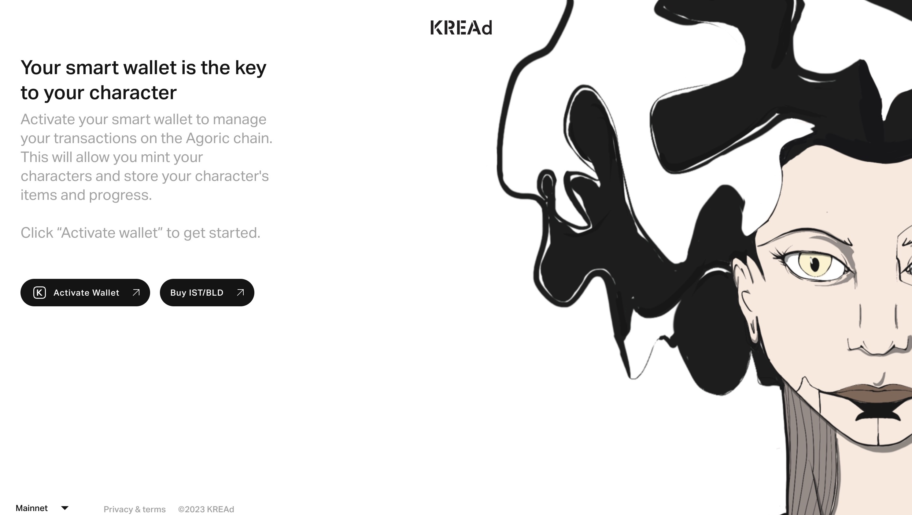

# About
KREAd is a dynamic NFT application showcasing the SAGES universe. It is built on [Agoric](https://docs.agoric.com/), a blockchain and smart-contract platform in the [Cosmos ecosystem](https://cosmos.network/).

KREAd dynamic NFTs provide new ways of showcasing and interacting with digital art by allowing users to customize a given NFT by equipping or unequipping "item" NFTs to its inventory. To understand how this works, let's define the two assets that KREAd introduces:

**Character**: represents a character in the SAGES universe. Each character can be identified by a unique image and a set of properties related to the SAGES story. They can be minted for a flat fee via KREAd's frontend. When minting, the user must choose a valid name for the character, and will receive a randomly selected character from a predefined set. They can be sold and bought by anyone using the marketplace section of KREAd's frontend. Each KREAd Character has an Inventory, which can be used to store Items within it.

**Item sft**: represents items in the SAGES universe that can be equipped to and from a Character's Inventory. Each Item contains an image showing how it looks as well as a set of properties. Items can be equipped to and unequipped from a Character's inventory by its owner, doing so results in changes to the Character's appearance and [dynamic] properties, such as the character level. They can be sold and bought by anyone using the marketplace section of KREAd's frontend.

| KREAd SFT 	| description                                                                                      	| represents                               	| how to obtain                                             	|
|-----------	|--------------------------------------------------------------------------------------------------	|------------------------------------------	|-----------------------------------------------------------	|
| Character 	| a collectable digital asset with an inventory where Items can be equipped to and unequipped from 	| a character in the SAGES universe        	| mint from KREAd's home page or buy on KREAd's marketplace 	|
| Item      	| a collectable digital asset that can be equipped to a Character's inventory                      	| a wearable asset from the SAGES universe 	| buy on KREAd's marketplace                                	|

# Using KREAd

The following section contains instructions for setting up an Agoric address and using the basic features of KREAd.

##### Set up Agoric wallet

In order to use KREAd, you must have a working wallet in order to sign transactions on the Agoric chain. Any [Cosmos](https://cosmos.network/) wallet will work, the following section explains how to create a Keplr wallet:

1. Navigate to the Keplr Wallet extension in the browser of your choosing  and follow the on-screen prompts to add the extension to your web browser.

2. Open the browser extension and select Create new account.

3. Copy your mnemonic seed phrase and store it somewhere safe

>💡 Ensure that you store your mnemonic seed phrase somewhere safe where it cannot be lost or compromised. Your mnemonic seed phrase is the master key to your wallet; loss or compromise of your mnemonic seed phrase may result in permanent loss of your ATOM.

4. Establish an account name and password, then select Next.

5. Confirm your mnemonic seed phrase and select Register.

##### Add Agoric network to Keplr
Cosmos wallets are designed to sign transactions on any Cosmos network, so in order to access your Agoric account you must first select the network on the wallet interface:

1. Open your Keplr wallet extension
2. In the drop down network menu in the center, select “Agoric.”
3. In your Agoric account, you’ll see a long string beginning with ‘agoric,’ which is your wallet address. (i.e. agoric132…f3fd)
4. Click on the wallet address to copy it
   
##### Provision smart wallet account
Once you have access to your Agoric address using a wallet, you are ready to provision an Agoric smart wallet. This step is necessary in order to enable the full functionality of the Agoric smart contract platform.

1. Obtain 10BLD (this provision fee is meant to mitigate potential Denial-of-Service attacks). Checkout [this section](https://docs.inter.trade/user-how-to/wallet-usage/acquiring-bld-tokens) from [Inter Protocol](https://inter.trade/)'s documentation for more information on how to obtain BLD.
   >💡 You can get BLD using [Kado](https://www.kado.money/)'s fiat on-ramp directly from the KREAd frontend. Navigate to https://kread.app/connect-wallet, click "Buy IST/BLD" and follow the prompts to try it.

   

2. Navigate to https://kread.app/connect-wallet
3. Hit 'Activate Wallet' 
   
4. Approve transaction in your Keplr wallet (or your Ledger)
5. Once your smart wallet provisions you will should see your IST balance go up to 0.25, which can be used to pay for transaction fees. The page will automatically redirect to https://kread.app/character and you will be ready to use KREAd or any other Agoric dapp.

##### Mint a Character
Anyone with an Agoric address and 5 IST can mint a Character by clicking the "Mint new" button from https://kread.app/character. If you don't have any characters yet the button should be visible in the center of the page, if you already have some you can get to it by clicking "My characters" in the top right of the interface, then scrolling to the bottom of the sidebar on the right:

That will take you to the mint character form, follow the prompts to mint a randomly generated KREAd Character. More details about KREAd Characters [here](./glossary.md#character-sft).

> 💡 Although there is no mint item functionality, when a Character is minted, 3 randomly selected items will be minted and equipped to the Character before it gets sent to your wallet.

##### Buy an Item (or Character)
Besides the mint flow, there is one other way to obtain a Character: the KREAd Marketplace. It functions as a simple p2p marketplace for KREAd Characters and Items, allowing anyone to list their asset for sale at a price of their choosing. Unlike minting, when using the marketplace you are free to browse through the available entries and decide which asset to get based on its properties and price (remember: minting gets you a random Character). To buy an Item on the marketplace:

1. Navigate to https://kread.app/shop/items
   
2. Browse the entries and find an Item you would like to buy (click on the item for a detailed view)
3. Then click "Buy" from the Item card or the detailed view
4. This will take you to the buy form where you can review the sale price and details before triggering the transaction to buy
   
5. Once reviewed, click confirm in order to send the transaction to Keplr for signing
6. Approve the transaction on Keplr
7. Await confirmation

You can verify the purchase was successful by browsing the [inventory](https://kread.app/inventory). For more details check out [KREAd Marketplace](./glossary.md#marketplace).

##### Equip an Item

With an unequipped item in your wallet, you are ready to use the equip feature. This allows you to customize a Character by adding an Item to its inventory, to learn more about how this works checkout [Character Inventory](./glossary.md#character-inventory). In this section we will focus on the how-to:

1. Navigate to the [character view](https://kread.app/character)
2. Select the Character you wish to equip the item to (use "My Characters" button in the top-right of the interface to switch characters if you need to)
3. Click on the category of Item you wish to equip (for the purposes of this tutorial lets select the category of the item bough in the previous step). This interface allows you to select any unequipped Item you own (within the selected category) so you can preview how it will look once equipped.
   
4. Having the item you would like to equip selected, click "Equip" to trigger an equip transaction
5. Approve the transaction using your wallet of choice and wait for the call to settle (may take up to 1 minute), you will see a change in the character once it does
   

> 💡 The unequip flow works in the same way, but of course in that case the item is transferred from the Character's inventory to the user's wallet. There is a third inventory action called swap, this allows an inventory item to be swapped for an item of the same category. Since Character inventories are limited to a single Item per category, when a user performs the equip flow shown above in a category that already contains an Item, a swap will be called instead of equip. 

##### Sell your Character

Great, now that you know how to mint a Character, manage its inventory and get Items from the marketplace, let's go over placing a Character or Item for sale. 

1. Navigate to [KREAD's Character page](https://kread.app/character)
2. Click the info button below your character's name to enter the character details view
3. Click "Sell" on the top right of the interface
4. Enter the desired price in IST
   > 💡 10% artist royalties and 3% platform fees are added on top of the price you enter
5. Review the price breakdown and click "Send offer"
6. Sign the Sell transaction on your wallet
7. Navigate to https://kread.app/shop/characters to verify your character was added to the market

> 💡 The sell button is present in many sections of the KREAd frontend for both Character and Item assets and will work in the same way

